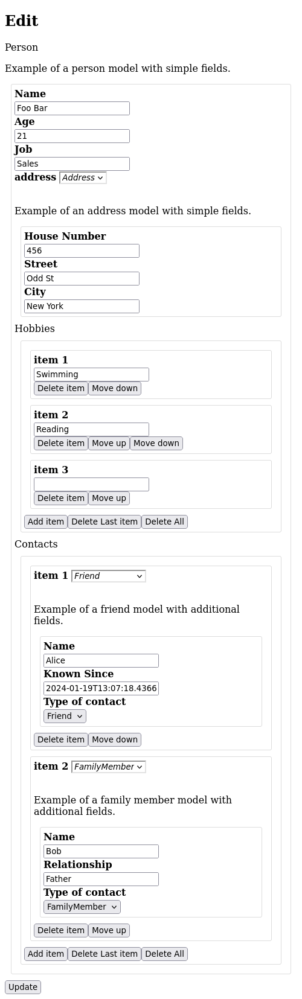

# Pydantic form example

Want to generate forms from [Pydantic](https://docs.pydantic.dev/) models automatically
using [JSON Editor](https://github.com/json-editor/json-editor)? It doesn't work "out of the box", so here are the steps
you need to make it work.

I spent a lot of time looking for a solution similar
to [Django's admin interface](https://docs.djangoproject.com/en/5.1/ref/contrib/admin/) for Pydantic, and there are not
a lot of good choices. This combination seems like the best at the moment, and hopefully this documentation will save
someone from having to figure out all the integration issues again.



## Contents

- [The Problem](./0_the_problem/README.md)
- [Form Submission](./1_form_submission/README.md)
- [Nested Model](./2_nested_model/README.md)
- [Nested List](./3_nested_list/README.md)
- [Nested Union](./4_nested_union/README.md)

## Setup

Optionally download json-editor locally (otherwise it will use a CDN):

```shell
mkdir -p static
wget -O ./static/jsoneditor.min.js https://cdn.jsdelivr.net/npm/@json-editor/json-editor@latest/dist/jsoneditor.min.js
```

## Testing

To run all tests, and generate screenshots of the pages, run:

```shell
playwright install firefox
for i in */test.py; do uv run $i; done
```
